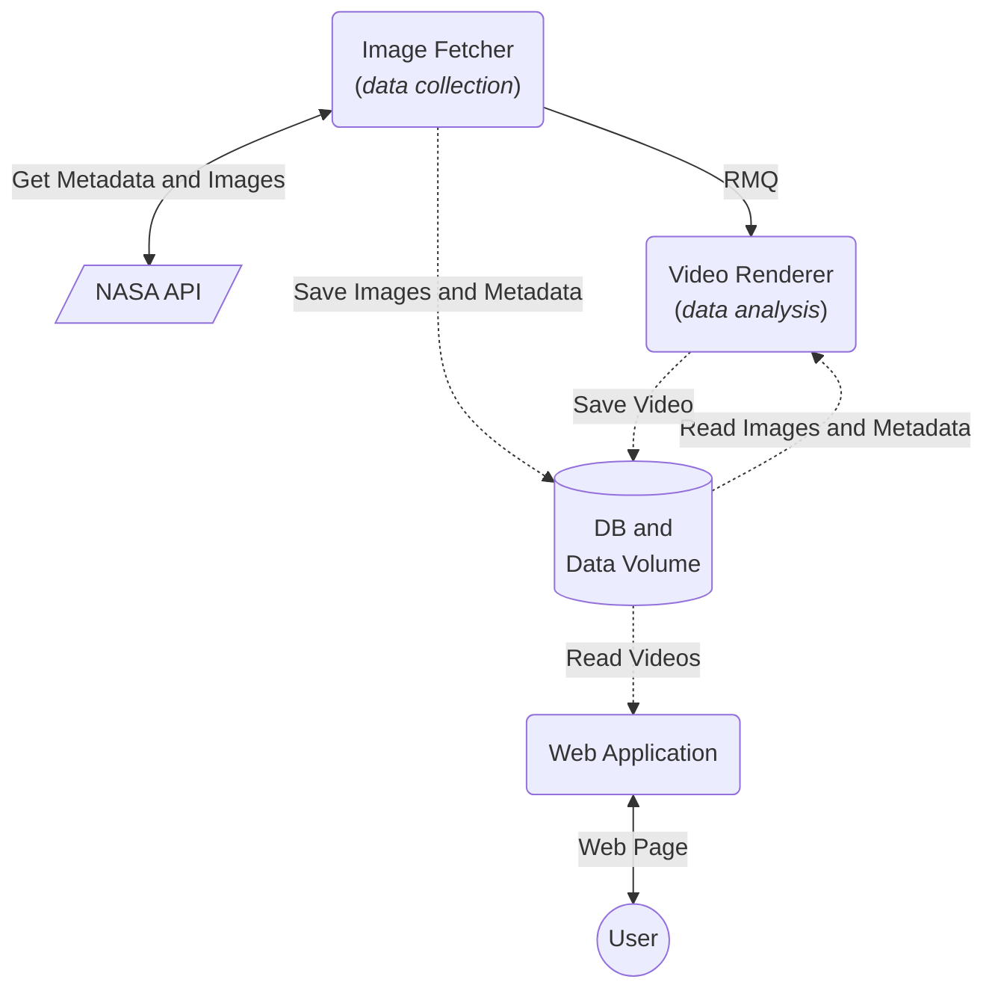

```mermaid
flowchart TD
    A("`Image Fetcher 
    (_data collection_)`")<-- Get Metadata and Images -->N[/NASA API/]
    A -->|RMQ| B("`Video Renderer
    (_data analysis_)`")
    A -.->|Save Images and Metadata| D[("DB and
    Data Volume")]
    D -.->|Read Images and Metadata| B
    B -.->|Save Video| D
    C(Web Application) <-->|Web Page| F((User))
    D -.->|Read Videos| C
```
