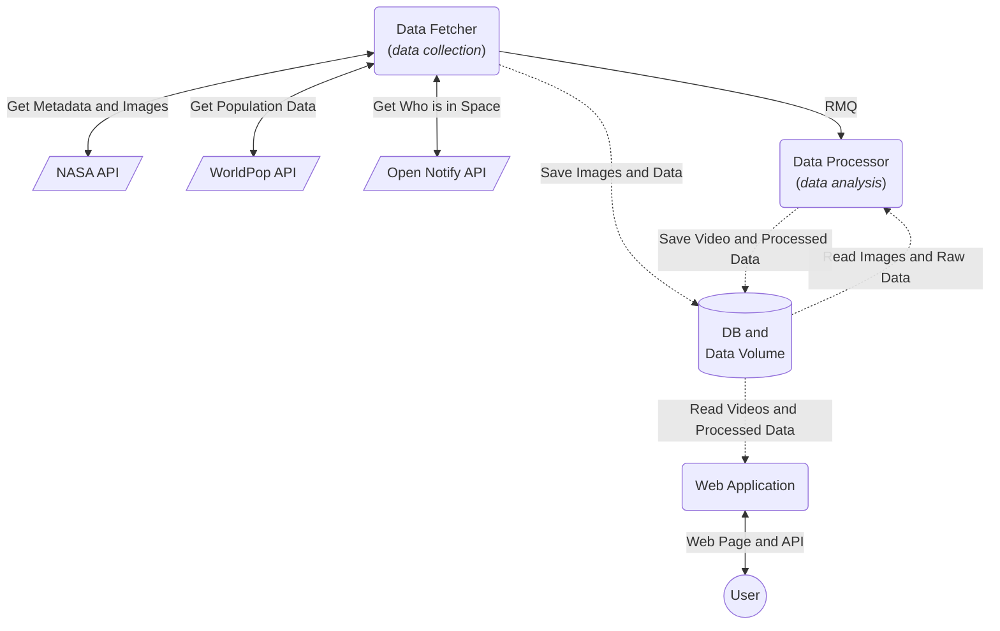

```mermaid
flowchart TD
    A("`Data Fetcher 
    (_data collection_)`")<-- Get Metadata and Images -->N[/NASA API/]
    A<-- Get Population Data -->W[/WorldPop API/]
    A<-- Get Who is in Space -->S[/Open Notify API/]
    A -->|RMQ| B("`Data Processor
    (_data analysis_)`")
    A -.->|Save Images and Data| D[("DB and
    Data Volume")]
    D -.->|Read Images and Raw Data| B
    B -.->|Save Video and Processed Data| D
    C(Web Application) <-->|Web Page and API| F((User))
    D -.->|Read Videos and Processed Data| C
```
